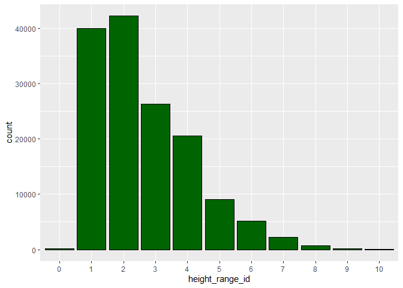
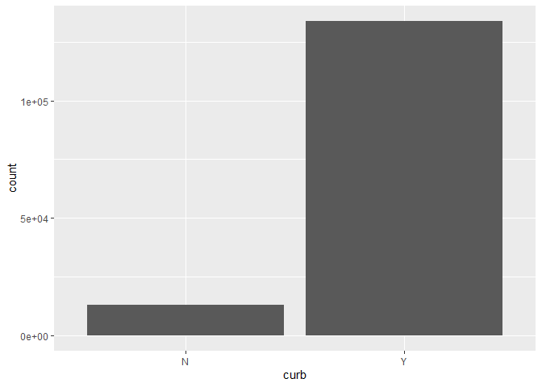
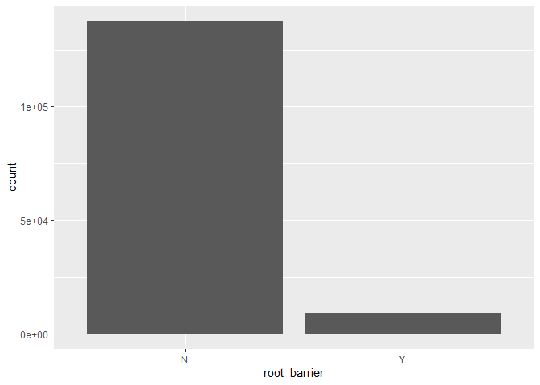
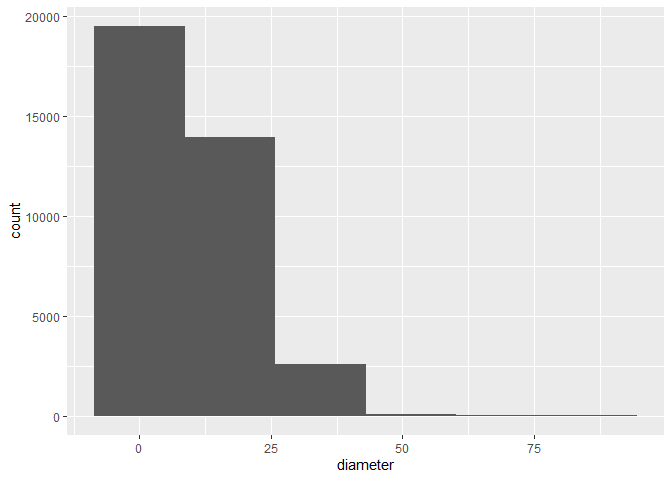
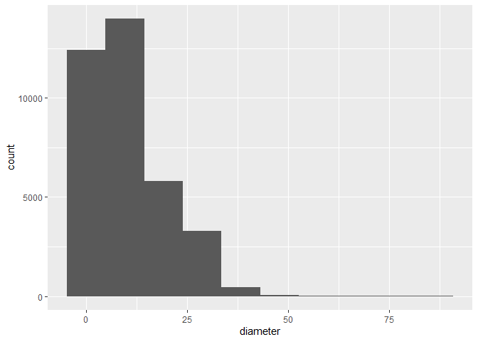
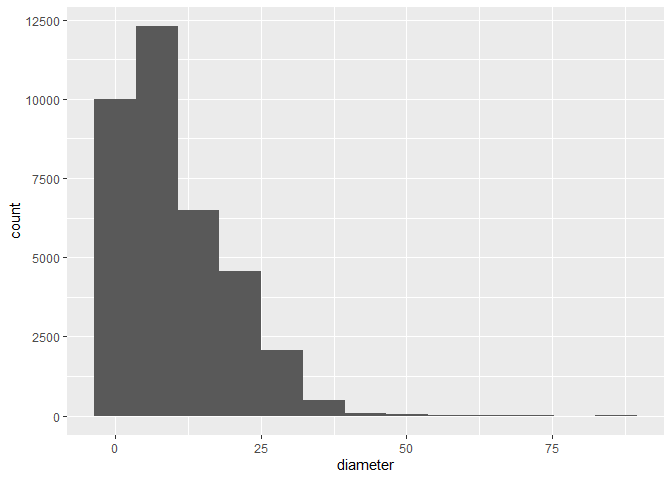
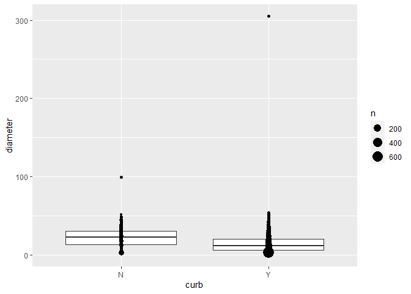
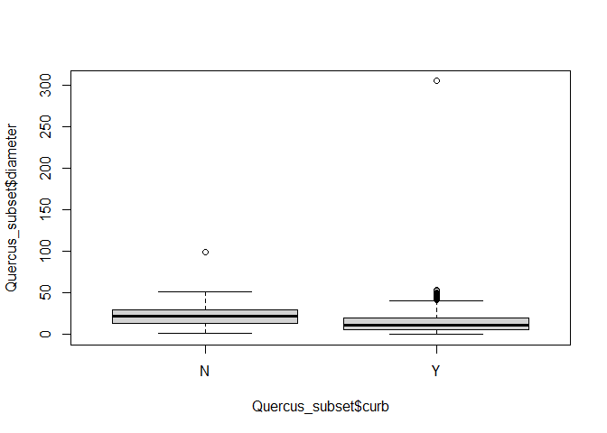
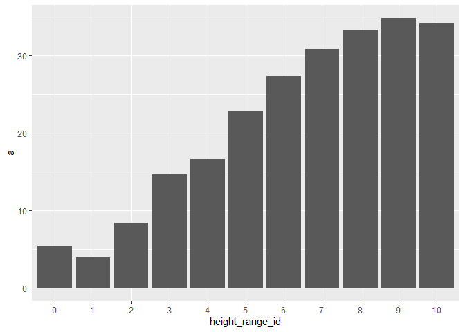

Mini Data-Analysis Deliverable 1
================

# Welcome to your (maybe) first-ever data analysis project!

And hopefully the first of many. Let’s get started:

1.  Install the [`datateachr`](https://github.com/UBC-MDS/datateachr)
    package by typing the following into your **R terminal**:

<!-- -->

    install.packages("devtools")
    devtools::install_github("UBC-MDS/datateachr")

2.  Load the packages below.

``` r
library(datateachr)
library(tidyverse)
```

    ## ── Attaching packages ─────────────────────────────────────── tidyverse 1.3.2 ──
    ## ✔ ggplot2 3.3.6      ✔ purrr   0.3.4 
    ## ✔ tibble  3.1.8      ✔ dplyr   1.0.10
    ## ✔ tidyr   1.2.1      ✔ stringr 1.4.1 
    ## ✔ readr   2.1.2      ✔ forcats 0.5.2 
    ## ── Conflicts ────────────────────────────────────────── tidyverse_conflicts() ──
    ## ✖ dplyr::filter() masks stats::filter()
    ## ✖ dplyr::lag()    masks stats::lag()

3.  Make a repository in the <https://github.com/stat545ubc-2022>
    Organization. You will be working with this repository for the
    entire data analysis project. You can either make it public, or make
    it private and add the TA’s and Lucy as collaborators. A link to
    help you create a private repository is available on the
    \#collaborative-project Slack channel.

# Instructions

## For Both Milestones

- Each milestone is worth 45 points. The number of points allocated to
  each task will be annotated within each deliverable. Tasks that are
  more challenging will often be allocated more points.

- 10 points will be allocated to the reproducibility, cleanliness, and
  coherence of the overall analysis. While the two milestones will be
  submitted as independent deliverables, the analysis itself is a
  continuum - think of it as two chapters to a story. Each chapter, or
  in this case, portion of your analysis, should be easily followed
  through by someone unfamiliar with the content.
  [Here](https://swcarpentry.github.io/r-novice-inflammation/06-best-practices-R/)
  is a good resource for what constitutes “good code”. Learning good
  coding practices early in your career will save you hassle later on!

## For Milestone 1

**To complete this milestone**, edit [this very `.Rmd`
file](https://raw.githubusercontent.com/UBC-STAT/stat545.stat.ubc.ca/master/content/mini-project/mini-project-1.Rmd)
directly. Fill in the sections that are tagged with
`<!--- start your work below --->`.

**To submit this milestone**, make sure to knit this `.Rmd` file to an
`.md` file by changing the YAML output settings from
`output: html_document` to `output: github_document`. Commit and push
all of your work to the mini-analysis GitHub repository you made
earlier, and tag a release on GitHub. Then, submit a link to your tagged
release on canvas.

**Points**: This milestone is worth 45 points: 43 for your analysis, 1
point for having your Milestone 1 document knit error-free, and 1 point
for tagging your release on Github.

# Learning Objectives

By the end of this milestone, you should:

- Become familiar with your dataset of choosing
- Select 4 questions that you would like to answer with your data
- Generate a reproducible and clear report using R Markdown
- Become familiar with manipulating and summarizing your data in tibbles
  using `dplyr`, with a research question in mind.

# Task 1: Choose your favorite dataset (10 points)

The `datateachr` package by Hayley Boyce and Jordan Bourak currently
composed of 7 semi-tidy datasets for educational purposes. Here is a
brief description of each dataset:

- *apt_buildings*: Acquired courtesy of The City of Toronto’s Open Data
  Portal. It currently has 3455 rows and 37 columns.

- *building_permits*: Acquired courtesy of The City of Vancouver’s Open
  Data Portal. It currently has 20680 rows and 14 columns.

- *cancer_sample*: Acquired courtesy of UCI Machine Learning Repository.
  It currently has 569 rows and 32 columns.

- *flow_sample*: Acquired courtesy of The Government of Canada’s
  Historical Hydrometric Database. It currently has 218 rows and 7
  columns.

- *parking_meters*: Acquired courtesy of The City of Vancouver’s Open
  Data Portal. It currently has 10032 rows and 22 columns.

- *steam_games*: Acquired courtesy of Kaggle. It currently has 40833
  rows and 21 columns.

- *vancouver_trees*: Acquired courtesy of The City of Vancouver’s Open
  Data Portal. It currently has 146611 rows and 20 columns.

**Things to keep in mind**

- We hope that this project will serve as practice for carrying our your
  own *independent* data analysis. Remember to comment your code, be
  explicit about what you are doing, and write notes in this markdown
  document when you feel that context is required. As you advance in the
  project, prompts and hints to do this will be diminished - it’ll be up
  to you!

- Before choosing a dataset, you should always keep in mind **your
  goal**, or in other ways, *what you wish to achieve with this data*.
  This mini data-analysis project focuses on *data wrangling*,
  *tidying*, and *visualization*. In short, it’s a way for you to get
  your feet wet with exploring data on your own.

And that is exactly the first thing that you will do!

1.1 Out of the 7 datasets available in the `datateachr` package, choose
**4** that appeal to you based on their description. Write your choices
below:

**Note**: We encourage you to use the ones in the `datateachr` package,
but if you have a dataset that you’d really like to use, you can include
it here. But, please check with a member of the teaching team to see
whether the dataset is of appropriate complexity. Also, include a
**brief** description of the dataset here to help the teaching team
understand your data.

<!-------------------------- Start your work below ---------------------------->

1: CHOICE_1\_HERE: cancer_sample 2: CHOICE_2\_HERE: steam_games 3:
CHOICE_3\_HERE: flow_sample 4: CHOICE_4\_HERE: Vancouver_trees

<!----------------------------------------------------------------------------->

1.2 One way to narrowing down your selection is to *explore* the
datasets. Use your knowledge of dplyr to find out at least *3*
attributes about each of these datasets (an attribute is something such
as number of rows, variables, class type…). The goal here is to have an
idea of *what the data looks like*.

*Hint:* This is one of those times when you should think about the
cleanliness of your analysis. I added a single code chunk for you below,
but do you want to use more than one? Would you like to write more
comments outside of the code chunk?

<!-------------------------- Start your work below ---------------------------->

``` r
### EXPLORE HERE##
#Exploring Cancer_Data
datateachr::cancer_sample
```

    ## # A tibble: 569 × 32
    ##          ID diagnosis radius_m…¹ textu…² perim…³ area_…⁴ smoot…⁵ compa…⁶ conca…⁷
    ##       <dbl> <chr>          <dbl>   <dbl>   <dbl>   <dbl>   <dbl>   <dbl>   <dbl>
    ##  1   842302 M               18.0    10.4   123.    1001   0.118   0.278   0.300 
    ##  2   842517 M               20.6    17.8   133.    1326   0.0847  0.0786  0.0869
    ##  3 84300903 M               19.7    21.2   130     1203   0.110   0.160   0.197 
    ##  4 84348301 M               11.4    20.4    77.6    386.  0.142   0.284   0.241 
    ##  5 84358402 M               20.3    14.3   135.    1297   0.100   0.133   0.198 
    ##  6   843786 M               12.4    15.7    82.6    477.  0.128   0.17    0.158 
    ##  7   844359 M               18.2    20.0   120.    1040   0.0946  0.109   0.113 
    ##  8 84458202 M               13.7    20.8    90.2    578.  0.119   0.164   0.0937
    ##  9   844981 M               13      21.8    87.5    520.  0.127   0.193   0.186 
    ## 10 84501001 M               12.5    24.0    84.0    476.  0.119   0.240   0.227 
    ## # … with 559 more rows, 23 more variables: concave_points_mean <dbl>,
    ## #   symmetry_mean <dbl>, fractal_dimension_mean <dbl>, radius_se <dbl>,
    ## #   texture_se <dbl>, perimeter_se <dbl>, area_se <dbl>, smoothness_se <dbl>,
    ## #   compactness_se <dbl>, concavity_se <dbl>, concave_points_se <dbl>,
    ## #   symmetry_se <dbl>, fractal_dimension_se <dbl>, radius_worst <dbl>,
    ## #   texture_worst <dbl>, perimeter_worst <dbl>, area_worst <dbl>,
    ## #   smoothness_worst <dbl>, compactness_worst <dbl>, concavity_worst <dbl>, …

``` r
head(cancer_sample)
```

    ## # A tibble: 6 × 32
    ##       ID diagn…¹ radiu…² textu…³ perim…⁴ area_…⁵ smoot…⁶ compa…⁷ conca…⁸ conca…⁹
    ##    <dbl> <chr>     <dbl>   <dbl>   <dbl>   <dbl>   <dbl>   <dbl>   <dbl>   <dbl>
    ## 1 8.42e5 M          18.0    10.4   123.    1001   0.118   0.278   0.300   0.147 
    ## 2 8.43e5 M          20.6    17.8   133.    1326   0.0847  0.0786  0.0869  0.0702
    ## 3 8.43e7 M          19.7    21.2   130     1203   0.110   0.160   0.197   0.128 
    ## 4 8.43e7 M          11.4    20.4    77.6    386.  0.142   0.284   0.241   0.105 
    ## 5 8.44e7 M          20.3    14.3   135.    1297   0.100   0.133   0.198   0.104 
    ## 6 8.44e5 M          12.4    15.7    82.6    477.  0.128   0.17    0.158   0.0809
    ## # … with 22 more variables: symmetry_mean <dbl>, fractal_dimension_mean <dbl>,
    ## #   radius_se <dbl>, texture_se <dbl>, perimeter_se <dbl>, area_se <dbl>,
    ## #   smoothness_se <dbl>, compactness_se <dbl>, concavity_se <dbl>,
    ## #   concave_points_se <dbl>, symmetry_se <dbl>, fractal_dimension_se <dbl>,
    ## #   radius_worst <dbl>, texture_worst <dbl>, perimeter_worst <dbl>,
    ## #   area_worst <dbl>, smoothness_worst <dbl>, compactness_worst <dbl>,
    ## #   concavity_worst <dbl>, concave_points_worst <dbl>, symmetry_worst <dbl>, …

``` r
class(cancer_sample)
```

    ## [1] "spec_tbl_df" "tbl_df"      "tbl"         "data.frame"

``` r
summary(cancer_sample)
```

    ##        ID             diagnosis          radius_mean      texture_mean  
    ##  Min.   :     8670   Length:569         Min.   : 6.981   Min.   : 9.71  
    ##  1st Qu.:   869218   Class :character   1st Qu.:11.700   1st Qu.:16.17  
    ##  Median :   906024   Mode  :character   Median :13.370   Median :18.84  
    ##  Mean   : 30371831                      Mean   :14.127   Mean   :19.29  
    ##  3rd Qu.:  8813129                      3rd Qu.:15.780   3rd Qu.:21.80  
    ##  Max.   :911320502                      Max.   :28.110   Max.   :39.28  
    ##  perimeter_mean     area_mean      smoothness_mean   compactness_mean 
    ##  Min.   : 43.79   Min.   : 143.5   Min.   :0.05263   Min.   :0.01938  
    ##  1st Qu.: 75.17   1st Qu.: 420.3   1st Qu.:0.08637   1st Qu.:0.06492  
    ##  Median : 86.24   Median : 551.1   Median :0.09587   Median :0.09263  
    ##  Mean   : 91.97   Mean   : 654.9   Mean   :0.09636   Mean   :0.10434  
    ##  3rd Qu.:104.10   3rd Qu.: 782.7   3rd Qu.:0.10530   3rd Qu.:0.13040  
    ##  Max.   :188.50   Max.   :2501.0   Max.   :0.16340   Max.   :0.34540  
    ##  concavity_mean    concave_points_mean symmetry_mean    fractal_dimension_mean
    ##  Min.   :0.00000   Min.   :0.00000     Min.   :0.1060   Min.   :0.04996       
    ##  1st Qu.:0.02956   1st Qu.:0.02031     1st Qu.:0.1619   1st Qu.:0.05770       
    ##  Median :0.06154   Median :0.03350     Median :0.1792   Median :0.06154       
    ##  Mean   :0.08880   Mean   :0.04892     Mean   :0.1812   Mean   :0.06280       
    ##  3rd Qu.:0.13070   3rd Qu.:0.07400     3rd Qu.:0.1957   3rd Qu.:0.06612       
    ##  Max.   :0.42680   Max.   :0.20120     Max.   :0.3040   Max.   :0.09744       
    ##    radius_se        texture_se      perimeter_se       area_se       
    ##  Min.   :0.1115   Min.   :0.3602   Min.   : 0.757   Min.   :  6.802  
    ##  1st Qu.:0.2324   1st Qu.:0.8339   1st Qu.: 1.606   1st Qu.: 17.850  
    ##  Median :0.3242   Median :1.1080   Median : 2.287   Median : 24.530  
    ##  Mean   :0.4052   Mean   :1.2169   Mean   : 2.866   Mean   : 40.337  
    ##  3rd Qu.:0.4789   3rd Qu.:1.4740   3rd Qu.: 3.357   3rd Qu.: 45.190  
    ##  Max.   :2.8730   Max.   :4.8850   Max.   :21.980   Max.   :542.200  
    ##  smoothness_se      compactness_se      concavity_se     concave_points_se 
    ##  Min.   :0.001713   Min.   :0.002252   Min.   :0.00000   Min.   :0.000000  
    ##  1st Qu.:0.005169   1st Qu.:0.013080   1st Qu.:0.01509   1st Qu.:0.007638  
    ##  Median :0.006380   Median :0.020450   Median :0.02589   Median :0.010930  
    ##  Mean   :0.007041   Mean   :0.025478   Mean   :0.03189   Mean   :0.011796  
    ##  3rd Qu.:0.008146   3rd Qu.:0.032450   3rd Qu.:0.04205   3rd Qu.:0.014710  
    ##  Max.   :0.031130   Max.   :0.135400   Max.   :0.39600   Max.   :0.052790  
    ##   symmetry_se       fractal_dimension_se  radius_worst   texture_worst  
    ##  Min.   :0.007882   Min.   :0.0008948    Min.   : 7.93   Min.   :12.02  
    ##  1st Qu.:0.015160   1st Qu.:0.0022480    1st Qu.:13.01   1st Qu.:21.08  
    ##  Median :0.018730   Median :0.0031870    Median :14.97   Median :25.41  
    ##  Mean   :0.020542   Mean   :0.0037949    Mean   :16.27   Mean   :25.68  
    ##  3rd Qu.:0.023480   3rd Qu.:0.0045580    3rd Qu.:18.79   3rd Qu.:29.72  
    ##  Max.   :0.078950   Max.   :0.0298400    Max.   :36.04   Max.   :49.54  
    ##  perimeter_worst    area_worst     smoothness_worst  compactness_worst
    ##  Min.   : 50.41   Min.   : 185.2   Min.   :0.07117   Min.   :0.02729  
    ##  1st Qu.: 84.11   1st Qu.: 515.3   1st Qu.:0.11660   1st Qu.:0.14720  
    ##  Median : 97.66   Median : 686.5   Median :0.13130   Median :0.21190  
    ##  Mean   :107.26   Mean   : 880.6   Mean   :0.13237   Mean   :0.25427  
    ##  3rd Qu.:125.40   3rd Qu.:1084.0   3rd Qu.:0.14600   3rd Qu.:0.33910  
    ##  Max.   :251.20   Max.   :4254.0   Max.   :0.22260   Max.   :1.05800  
    ##  concavity_worst  concave_points_worst symmetry_worst   fractal_dimension_worst
    ##  Min.   :0.0000   Min.   :0.00000      Min.   :0.1565   Min.   :0.05504        
    ##  1st Qu.:0.1145   1st Qu.:0.06493      1st Qu.:0.2504   1st Qu.:0.07146        
    ##  Median :0.2267   Median :0.09993      Median :0.2822   Median :0.08004        
    ##  Mean   :0.2722   Mean   :0.11461      Mean   :0.2901   Mean   :0.08395        
    ##  3rd Qu.:0.3829   3rd Qu.:0.16140      3rd Qu.:0.3179   3rd Qu.:0.09208        
    ##  Max.   :1.2520   Max.   :0.29100      Max.   :0.6638   Max.   :0.20750

``` r
#Exploring Flow_Sample
datateachr::flow_sample
```

    ## # A tibble: 218 × 7
    ##    station_id  year extreme_type month   day  flow sym  
    ##    <chr>      <dbl> <chr>        <dbl> <dbl> <dbl> <chr>
    ##  1 05BB001     1909 maximum          7     7   314 <NA> 
    ##  2 05BB001     1910 maximum          6    12   230 <NA> 
    ##  3 05BB001     1911 maximum          6    14   264 <NA> 
    ##  4 05BB001     1912 maximum          8    25   174 <NA> 
    ##  5 05BB001     1913 maximum          6    11   232 <NA> 
    ##  6 05BB001     1914 maximum          6    18   214 <NA> 
    ##  7 05BB001     1915 maximum          6    27   236 <NA> 
    ##  8 05BB001     1916 maximum          6    20   309 <NA> 
    ##  9 05BB001     1917 maximum          6    17   174 <NA> 
    ## 10 05BB001     1918 maximum          6    15   345 <NA> 
    ## # … with 208 more rows

``` r
head(flow_sample)
```

    ## # A tibble: 6 × 7
    ##   station_id  year extreme_type month   day  flow sym  
    ##   <chr>      <dbl> <chr>        <dbl> <dbl> <dbl> <chr>
    ## 1 05BB001     1909 maximum          7     7   314 <NA> 
    ## 2 05BB001     1910 maximum          6    12   230 <NA> 
    ## 3 05BB001     1911 maximum          6    14   264 <NA> 
    ## 4 05BB001     1912 maximum          8    25   174 <NA> 
    ## 5 05BB001     1913 maximum          6    11   232 <NA> 
    ## 6 05BB001     1914 maximum          6    18   214 <NA>

``` r
class(flow_sample)
```

    ## [1] "tbl_df"     "tbl"        "data.frame"

``` r
summary(flow_sample)
```

    ##   station_id             year      extreme_type           month       
    ##  Length:218         Min.   :1909   Length:218         Min.   : 1.000  
    ##  Class :character   1st Qu.:1936   Class :character   1st Qu.: 3.000  
    ##  Mode  :character   Median :1963   Mode  :character   Median : 6.000  
    ##                     Mean   :1963                      Mean   : 5.046  
    ##                     3rd Qu.:1990                      3rd Qu.: 6.000  
    ##                     Max.   :2018                      Max.   :12.000  
    ##                                                       NA's   :2       
    ##       day             flow            sym           
    ##  Min.   : 1.00   Min.   :  3.62   Length:218        
    ##  1st Qu.: 8.00   1st Qu.:  6.18   Class :character  
    ##  Median :17.00   Median :114.00   Mode  :character  
    ##  Mean   :16.24   Mean   :110.13                     
    ##  3rd Qu.:25.00   3rd Qu.:204.25                     
    ##  Max.   :31.00   Max.   :466.00                     
    ##  NA's   :2       NA's   :2

``` r
#Exploring Vancouver_Trees
datateachr::vancouver_trees
```

    ## # A tibble: 146,611 × 20
    ##    tree_id civic_number std_st…¹ genus…² speci…³ culti…⁴ commo…⁵ assig…⁶ root_…⁷
    ##      <dbl>        <dbl> <chr>    <chr>   <chr>   <chr>   <chr>   <chr>   <chr>  
    ##  1  149556          494 W 58TH … ULMUS   AMERIC… BRANDON BRANDO… N       N      
    ##  2  149563          450 W 58TH … ZELKOVA SERRATA <NA>    JAPANE… N       N      
    ##  3  149579         4994 WINDSOR… STYRAX  JAPONI… <NA>    JAPANE… N       N      
    ##  4  149590          858 E 39TH … FRAXIN… AMERIC… AUTUMN… AUTUMN… Y       N      
    ##  5  149604         5032 WINDSOR… ACER    CAMPES… <NA>    HEDGE … N       N      
    ##  6  149616          585 W 61ST … PYRUS   CALLER… CHANTI… CHANTI… N       N      
    ##  7  149617         4909 SHERBRO… ACER    PLATAN… COLUMN… COLUMN… N       N      
    ##  8  149618         4925 SHERBRO… ACER    PLATAN… COLUMN… COLUMN… N       N      
    ##  9  149619         4969 SHERBRO… ACER    PLATAN… COLUMN… COLUMN… N       N      
    ## 10  149625          720 E 39TH … FRAXIN… AMERIC… AUTUMN… AUTUMN… N       N      
    ## # … with 146,601 more rows, 11 more variables: plant_area <chr>,
    ## #   on_street_block <dbl>, on_street <chr>, neighbourhood_name <chr>,
    ## #   street_side_name <chr>, height_range_id <dbl>, diameter <dbl>, curb <chr>,
    ## #   date_planted <date>, longitude <dbl>, latitude <dbl>, and abbreviated
    ## #   variable names ¹​std_street, ²​genus_name, ³​species_name, ⁴​cultivar_name,
    ## #   ⁵​common_name, ⁶​assigned, ⁷​root_barrier

``` r
head(vancouver_trees)
```

    ## # A tibble: 6 × 20
    ##   tree_id civic_number std_str…¹ genus…² speci…³ culti…⁴ commo…⁵ assig…⁶ root_…⁷
    ##     <dbl>        <dbl> <chr>     <chr>   <chr>   <chr>   <chr>   <chr>   <chr>  
    ## 1  149556          494 W 58TH AV ULMUS   AMERIC… BRANDON BRANDO… N       N      
    ## 2  149563          450 W 58TH AV ZELKOVA SERRATA <NA>    JAPANE… N       N      
    ## 3  149579         4994 WINDSOR … STYRAX  JAPONI… <NA>    JAPANE… N       N      
    ## 4  149590          858 E 39TH AV FRAXIN… AMERIC… AUTUMN… AUTUMN… Y       N      
    ## 5  149604         5032 WINDSOR … ACER    CAMPES… <NA>    HEDGE … N       N      
    ## 6  149616          585 W 61ST AV PYRUS   CALLER… CHANTI… CHANTI… N       N      
    ## # … with 11 more variables: plant_area <chr>, on_street_block <dbl>,
    ## #   on_street <chr>, neighbourhood_name <chr>, street_side_name <chr>,
    ## #   height_range_id <dbl>, diameter <dbl>, curb <chr>, date_planted <date>,
    ## #   longitude <dbl>, latitude <dbl>, and abbreviated variable names
    ## #   ¹​std_street, ²​genus_name, ³​species_name, ⁴​cultivar_name, ⁵​common_name,
    ## #   ⁶​assigned, ⁷​root_barrier

``` r
class(vancouver_trees)
```

    ## [1] "tbl_df"     "tbl"        "data.frame"

``` r
summary(vancouver_trees)
```

    ##     tree_id        civic_number    std_street         genus_name       
    ##  Min.   :    12   Min.   :    0   Length:146611      Length:146611     
    ##  1st Qu.: 65464   1st Qu.: 1306   Class :character   Class :character  
    ##  Median :134903   Median : 2604   Mode  :character   Mode  :character  
    ##  Mean   :131892   Mean   : 2937                                        
    ##  3rd Qu.:194450   3rd Qu.: 4005                                        
    ##  Max.   :266203   Max.   :17888                                        
    ##                                                                        
    ##  species_name       cultivar_name      common_name          assigned        
    ##  Length:146611      Length:146611      Length:146611      Length:146611     
    ##  Class :character   Class :character   Class :character   Class :character  
    ##  Mode  :character   Mode  :character   Mode  :character   Mode  :character  
    ##                                                                             
    ##                                                                             
    ##                                                                             
    ##                                                                             
    ##  root_barrier        plant_area        on_street_block  on_street        
    ##  Length:146611      Length:146611      Min.   :   0    Length:146611     
    ##  Class :character   Class :character   1st Qu.:1300    Class :character  
    ##  Mode  :character   Mode  :character   Median :2600    Mode  :character  
    ##                                        Mean   :2909                      
    ##                                        3rd Qu.:4000                      
    ##                                        Max.   :9900                      
    ##                                                                          
    ##  neighbourhood_name street_side_name   height_range_id     diameter     
    ##  Length:146611      Length:146611      Min.   : 0.000   Min.   :  0.00  
    ##  Class :character   Class :character   1st Qu.: 1.000   1st Qu.:  3.50  
    ##  Mode  :character   Mode  :character   Median : 2.000   Median :  9.00  
    ##                                        Mean   : 2.627   Mean   : 11.49  
    ##                                        3rd Qu.: 4.000   3rd Qu.: 16.50  
    ##                                        Max.   :10.000   Max.   :435.00  
    ##                                                                         
    ##      curb            date_planted          longitude         latitude    
    ##  Length:146611      Min.   :1989-10-27   Min.   :-123.2   Min.   :49.20  
    ##  Class :character   1st Qu.:1998-02-23   1st Qu.:-123.1   1st Qu.:49.23  
    ##  Mode  :character   Median :2004-01-28   Median :-123.1   Median :49.25  
    ##                     Mean   :2004-04-07   Mean   :-123.1   Mean   :49.25  
    ##                     3rd Qu.:2010-03-02   3rd Qu.:-123.1   3rd Qu.:49.26  
    ##                     Max.   :2019-07-03   Max.   :-123.0   Max.   :49.29  
    ##                     NA's   :76548        NA's   :22771    NA's   :22771

``` r
#Exploring Building_permits
datateachr::building_permits
```

    ## # A tibble: 20,680 × 14
    ##    permit_n…¹ issue_date proje…² type_…³ address proje…⁴ build…⁵ build…⁶ appli…⁷
    ##    <chr>      <date>       <dbl> <chr>   <chr>   <chr>   <chr>   <chr>   <chr>  
    ##  1 BP-2016-0… 2017-02-01  0      Salvag… 4378 W… <NA>    <NA>     <NA>   Raffae…
    ##  2 BU468090   2017-02-01  0      New Bu… 1111 R… <NA>    <NA>     <NA>   MAX KE…
    ##  3 DB-2016-0… 2017-02-01  3.5 e4 Additi… 3732 W… <NA>    <NA>     <NA>   Peter …
    ##  4 DB-2017-0… 2017-02-01  1.5 e4 Additi… 88 W P… <NA>    Mercur… "88 W … Aaron …
    ##  5 DB452250   2017-02-01  1.81e5 New Bu… 492 E … <NA>    082016… "3559 … John H…
    ##  6 BP-2016-0… 2017-02-02  0      Salvag… 3332 W… <NA>    <NA>     <NA>   Shalin…
    ##  7 BP-2016-0… 2017-02-02  1.5 e4 Demoli… 2873 W… <NA>    <NA>     <NA>   Mike C…
    ##  8 BP-2016-0… 2017-02-02  0      Salvag… 3579 E… <NA>    <NA>     <NA>   Ricci …
    ##  9 BP-2016-0… 2017-02-02  6.5 e7 New Bu… 620 CA… <NA>    <NA>     <NA>   David …
    ## 10 BP-2016-0… 2017-02-02  2.5 e4 Additi… 1868 W… <NA>    RenBui… "1868 … Daniel…
    ## # … with 20,670 more rows, 5 more variables: applicant_address <chr>,
    ## #   property_use <chr>, specific_use_category <chr>, year <dbl>, bi_id <dbl>,
    ## #   and abbreviated variable names ¹​permit_number, ²​project_value,
    ## #   ³​type_of_work, ⁴​project_description, ⁵​building_contractor,
    ## #   ⁶​building_contractor_address, ⁷​applicant

``` r
head(building_permits)
```

    ## # A tibble: 6 × 14
    ##   permit_nu…¹ issue_date proje…² type_…³ address proje…⁴ build…⁵ build…⁶ appli…⁷
    ##   <chr>       <date>       <dbl> <chr>   <chr>   <chr>   <chr>   <chr>   <chr>  
    ## 1 BP-2016-02… 2017-02-01       0 Salvag… 4378 W… <NA>    <NA>     <NA>   Raffae…
    ## 2 BU468090    2017-02-01       0 New Bu… 1111 R… <NA>    <NA>     <NA>   MAX KE…
    ## 3 DB-2016-04… 2017-02-01   35000 Additi… 3732 W… <NA>    <NA>     <NA>   Peter …
    ## 4 DB-2017-00… 2017-02-01   15000 Additi… 88 W P… <NA>    Mercur… "88 W … Aaron …
    ## 5 DB452250    2017-02-01  181178 New Bu… 492 E … <NA>    082016… "3559 … John H…
    ## 6 BP-2016-01… 2017-02-02       0 Salvag… 3332 W… <NA>    <NA>     <NA>   Shalin…
    ## # … with 5 more variables: applicant_address <chr>, property_use <chr>,
    ## #   specific_use_category <chr>, year <dbl>, bi_id <dbl>, and abbreviated
    ## #   variable names ¹​permit_number, ²​project_value, ³​type_of_work,
    ## #   ⁴​project_description, ⁵​building_contractor, ⁶​building_contractor_address,
    ## #   ⁷​applicant

``` r
class(building_permits)
```

    ## [1] "spec_tbl_df" "tbl_df"      "tbl"         "data.frame"

``` r
summary(building_permits)
```

    ##  permit_number        issue_date         project_value       type_of_work      
    ##  Length:20680       Min.   :2017-01-03   Min.   :        0   Length:20680      
    ##  Class :character   1st Qu.:2017-09-25   1st Qu.:    10739   Class :character  
    ##  Mode  :character   Median :2018-07-18   Median :    48000   Mode  :character  
    ##                     Mean   :2018-07-24   Mean   :   609166                     
    ##                     3rd Qu.:2019-05-13   3rd Qu.:   217791                     
    ##                     Max.   :2020-04-29   Max.   :807185500                     
    ##                                          NA's   :52                            
    ##    address          project_description building_contractor
    ##  Length:20680       Length:20680        Length:20680       
    ##  Class :character   Class :character    Class :character   
    ##  Mode  :character   Mode  :character    Mode  :character   
    ##                                                            
    ##                                                            
    ##                                                            
    ##                                                            
    ##  building_contractor_address  applicant         applicant_address 
    ##  Length:20680                Length:20680       Length:20680      
    ##  Class :character            Class :character   Class :character  
    ##  Mode  :character            Mode  :character   Mode  :character  
    ##                                                                   
    ##                                                                   
    ##                                                                   
    ##                                                                   
    ##  property_use       specific_use_category      year          bi_id      
    ##  Length:20680       Length:20680          Min.   :2017   Min.   :    1  
    ##  Class :character   Class :character      1st Qu.:2017   1st Qu.: 5171  
    ##  Mode  :character   Mode  :character      Median :2018   Median :10340  
    ##                                           Mean   :2018   Mean   :10340  
    ##                                           3rd Qu.:2019   3rd Qu.:15510  
    ##                                           Max.   :2020   Max.   :20680  
    ## 

<!----------------------------------------------------------------------------->

1.3 Now that you’ve explored the 4 datasets that you were initially most
interested in, let’s narrow it down to 2. What lead you to choose these
2? Briefly explain your choices below, and feel free to include any code
in your explanation.

<!-------------------------- Start your work below ---------------------------->

My choice is vancouver_trees in which I am interested as I love trees
and the topic itself intrudes me, there are also variables of curb which
has binary response and will be useful to run logistic regression. I
also want to work with the cancer_sample data sets, I chose this because
I want to work with occupancy survey in future for my PhD thesis, whose
response is 0 or 1 (binary categorical).

<!----------------------------------------------------------------------------->

1.4 Time for the final decision! Going back to the beginning, it’s
important to have an *end goal* in mind. For example, if I had chosen
the `titanic` dataset for my project, I might’ve wanted to explore the
relationship between survival and other variables. Try to think of 1
research question that you would want to answer with each dataset. Note
them down below, and make your final choice based on what seems more
interesting to you!

<!-------------------------- Start your work below ---------------------------->

For the vancouver_trees dataset, I want to explore if the height of the
trees has any relationship with curb used. For next dataset, I want to
explore the relationship between diagnosis in which I want to explore if
the diagnosis of cancer with being B or M is determined by area where,
diagnosis as dependent (categorical) variable and area as independent
variable.

<!----------------------------------------------------------------------------->

# Important note

Read Tasks 2 and 3 *fully* before starting to complete either of them.
Probably also a good point to grab a coffee to get ready for the fun
part!

This project is semi-guided, but meant to be *independent*. For this
reason, you will complete tasks 2 and 3 below (under the **START HERE**
mark) as if you were writing your own exploratory data analysis report,
and this guidance never existed! Feel free to add a brief introduction
section to your project, format the document with markdown syntax as you
deem appropriate, and structure the analysis as you deem appropriate.
Remember, marks will be awarded for completion of the 4 tasks, but 10
points of the whole project are allocated to a reproducible and clean
analysis. If you feel lost, you can find a sample data analysis
[here](https://www.kaggle.com/headsortails/tidy-titarnic) to have a
better idea. However, bear in mind that it is **just an example** and
you will not be required to have that level of complexity in your
project.

# Task 2: Exploring your dataset (15 points)

If we rewind and go back to the learning objectives, you’ll see that by
the end of this deliverable, you should have formulated *4* research
questions about your data that you may want to answer during your
project. However, it may be handy to do some more exploration on your
dataset of choice before creating these questions - by looking at the
data, you may get more ideas. **Before you start this task, read all
instructions carefully until you reach START HERE under Task 3**.

2.1 Complete *4 out of the following 8 exercises* to dive deeper into
your data. All datasets are different and therefore, not all of these
tasks may make sense for your data - which is why you should only answer
*4*. Use *dplyr* and *ggplot*.

1.  Plot the distribution of a numeric variable.
2.  Create a new variable based on other variables in your data (only if
    it makes sense)
3.  Investigate how many missing values there are per variable. Can you
    find a way to plot this?
4.  Explore the relationship between 2 variables in a plot.
5.  Filter observations in your data according to your own criteria.
    Think of what you’d like to explore - again, if this was the
    `titanic` dataset, I may want to narrow my search down to passengers
    born in a particular year…
6.  Use a boxplot to look at the frequency of different observations
    within a single variable. You can do this for more than one variable
    if you wish!
7.  Make a new tibble with a subset of your data, with variables and
    observations that you are interested in exploring.
8.  Use a density plot to explore any of your variables (that are
    suitable for this type of plot).

2.2 For each of the 4 exercises that you complete, provide a *brief
explanation* of why you chose that exercise in relation to your data (in
other words, why does it make sense to do that?), and sufficient
comments for a reader to understand your reasoning and code.

<!-------------------------- Start your work below ---------------------------->

``` r
#First I want to understand the data and see the summary of the data set
vancouver_trees <- as.tibble(datateachr::vancouver_trees)
```

    ## Warning: `as.tibble()` was deprecated in tibble 2.0.0.
    ## Please use `as_tibble()` instead.
    ## The signature and semantics have changed, see `?as_tibble`.

``` r
vancouver_trees$height_range_id <- as.factor(vancouver_trees$height_range_id)

#I want to print the distribution of the diameter in the data 
ggplot(vancouver_trees, aes(height_range_id)) +
  geom_bar(stata="identity", fill="dark green", color= "black")
```

    ## Warning: Ignoring unknown parameters: stata

<!-- --> 2. Now, I want
to explore how many missing data are there in the the curb variable and
root barrier that I am interested in. This is also important as I may
have to decide to deal with the missing values in required way. If you
are replicating this project, don’t miss doing it!

``` r
#Check if there are many missing values 
any(is.na(vancouver_trees$curb))
```

    ## [1] FALSE

``` r
any(is.na(vancouver_trees$root_barrier))
```

    ## [1] FALSE

There are no missing data in the two predictor variables that I am
interested in. Hence I am not worried now.

3.  I want to conduct a regression and see if height of the trees is
    affected by the curb and the root barrier. But I am not sure if curb
    and root barrier are correlated to each other. If so, I may have to
    reconsider thinking of choosing only one of them to avoid
    collinearity. Since both variables are categorical that too nominal,
    I am conducting a chi square test.

``` r
test <-chisq.test(vancouver_trees$curb, vancouver_trees$root_barrier)
test
```

    ## 
    ##  Pearson's Chi-squared test with Yates' continuity correction
    ## 
    ## data:  vancouver_trees$curb and vancouver_trees$root_barrier
    ## X-squared = 8.248, df = 1, p-value = 0.00408

``` r
ggplot(aes(curb), data = vancouver_trees) + 
  geom_bar()
```

<!-- -->

``` r
  ggplot(aes(root_barrier), data = vancouver_trees)+ 
  geom_bar()
```

<!-- --> Since, both
the value of p is 0.00408 which is less than 0.05, thus it is seen that
the two explanatory variables are related to each other and I may have
to omit one of them. I decide to omit curb and keep root_barriers. I
have plotted the number of trees with root barrier and curb in 2
different plots.

4.  I want to create subset of the genus dataset to see if there is any
    relation of height and root barrier of Acer genus and Quercus
    species as the roots of Acer trees can spread out 12 feet wide and
    up to 3 feet deep and the root of Quercus goes 3-7 times deeper than
    their part above soil.

``` r
datateachr::vancouver_trees
```

    ## # A tibble: 146,611 × 20
    ##    tree_id civic_number std_st…¹ genus…² speci…³ culti…⁴ commo…⁵ assig…⁶ root_…⁷
    ##      <dbl>        <dbl> <chr>    <chr>   <chr>   <chr>   <chr>   <chr>   <chr>  
    ##  1  149556          494 W 58TH … ULMUS   AMERIC… BRANDON BRANDO… N       N      
    ##  2  149563          450 W 58TH … ZELKOVA SERRATA <NA>    JAPANE… N       N      
    ##  3  149579         4994 WINDSOR… STYRAX  JAPONI… <NA>    JAPANE… N       N      
    ##  4  149590          858 E 39TH … FRAXIN… AMERIC… AUTUMN… AUTUMN… Y       N      
    ##  5  149604         5032 WINDSOR… ACER    CAMPES… <NA>    HEDGE … N       N      
    ##  6  149616          585 W 61ST … PYRUS   CALLER… CHANTI… CHANTI… N       N      
    ##  7  149617         4909 SHERBRO… ACER    PLATAN… COLUMN… COLUMN… N       N      
    ##  8  149618         4925 SHERBRO… ACER    PLATAN… COLUMN… COLUMN… N       N      
    ##  9  149619         4969 SHERBRO… ACER    PLATAN… COLUMN… COLUMN… N       N      
    ## 10  149625          720 E 39TH … FRAXIN… AMERIC… AUTUMN… AUTUMN… N       N      
    ## # … with 146,601 more rows, 11 more variables: plant_area <chr>,
    ## #   on_street_block <dbl>, on_street <chr>, neighbourhood_name <chr>,
    ## #   street_side_name <chr>, height_range_id <dbl>, diameter <dbl>, curb <chr>,
    ## #   date_planted <date>, longitude <dbl>, latitude <dbl>, and abbreviated
    ## #   variable names ¹​std_street, ²​genus_name, ³​species_name, ⁴​cultivar_name,
    ## #   ⁵​common_name, ⁶​assigned, ⁷​root_barrier

``` r
#Creating subset of Acer Genus
Acer_subset <- filter(vancouver_trees, genus_name == "ACER")
#Creating subset of Quercus genus
Quercus_subset <- filter(vancouver_trees, genus_name == "QUERCUS")
```

<!----------------------------------------------------------------------------->

# Task 3: Write your research questions (5 points)

So far, you have chosen a dataset and gotten familiar with it through
exploring the data. Now it’s time to figure out 4 research questions
that you would like to answer with your data! Write the 4 questions and
any additional comments at the end of this deliverable. These questions
are not necessarily set in stone - TAs will review them and give you
feedback; therefore, you may choose to pursue them as they are for the
rest of the project, or make modifications!

<!--- *****START HERE***** --->

Question 1: How does diameter differ in two genus: Acer and Quercus?
Question 2: What are the diameters of the tree that are out of the range
of most of the data in quercus genus? Question 3: Is the diameter of
Quercus species significantly affected by curb? Question 4: Is the
diameter of one height class significantly different than other height
classes?

# Task 4: Process and summarize your data (13 points)

From Task 2, you should have an idea of the basic structure of your
dataset (e.g. number of rows and columns, class types, etc.). Here, we
will start investigating your data more in-depth using various data
manipulation functions.

### 1.1 (10 points)

Now, for each of your four research questions, choose one task from
options 1-4 (summarizing), and one other task from 4-8 (graphing). You
should have 2 tasks done for each research question (8 total). Make sure
it makes sense to do them! (e.g. don’t use a numerical variables for a
task that needs a categorical variable.). Comment on why each task helps
(or doesn’t!) answer the corresponding research question.

Ensure that the output of each operation is printed!

**Summarizing:**

1.  Compute the *range*, *mean*, and *two other summary statistics* of
    **one numerical variable** across the groups of **one categorical
    variable** from your data.
2.  Compute the number of observations for at least one of your
    categorical variables. Do not use the function `table()`!
3.  Create a categorical variable with 3 or more groups from an existing
    numerical variable. You can use this new variable in the other
    tasks! *An example: age in years into “child, teen, adult, senior”.*
4.  Based on two categorical variables, calculate two summary statistics
    of your choosing.

**Graphing:**

5.  Create a graph out of summarized variables that has at least two
    geom layers.
6.  Create a graph of your choosing, make one of the axes logarithmic,
    and format the axes labels so that they are “pretty” or easier to
    read.
7.  Make a graph where it makes sense to customize the alpha
    transparency.
8.  Create 3 histograms out of summarized variables, with each histogram
    having different sized bins. Pick the “best” one and explain why it
    is the best.

Make sure it’s clear what research question you are doing each operation
for!

<!------------------------- Start your work below ----------------------------->

Now I want to study the diameter differences between two genus. With the
help of summary data, I will try to visualize.

``` r
#Question1: 
#Task 1: summary
summary(Acer_subset$diameter)
```

    ##    Min. 1st Qu.  Median    Mean 3rd Qu.    Max. 
    ##    0.00    3.00    8.00   10.61   15.00  317.00

``` r
#300 diameter looks like outliers so to remove the outlier, lets create new #subset whose diameter is less than 100
Acer_subsetnew <- filter(Acer_subset, diameter < 100)
summary(Acer_subsetnew$diameter)
```

    ##    Min. 1st Qu.  Median    Mean 3rd Qu.    Max. 
    ##    0.00    3.00    8.00   10.58   15.00   86.00

``` r
summary(Quercus_subset$diameter)
```

    ##    Min. 1st Qu.  Median    Mean 3rd Qu.    Max. 
    ##    0.00    6.00   12.00   15.22   22.50  305.00

Now to graph and make histogram of diameter of Acer genus, we need to
decide number of bins, we already know that the minimum diameter is 0
and maximum is 305. Now, since the gap is high, we need more bins. But
let’s try with small number of bins (just to see what happens!)

``` r
#Task 2: graphing with less number of bins
ggplot(Acer_subsetnew, aes(x=diameter))+
  geom_histogram(bins = 6)
```

<!-- -->

We see that the information is not clear so lets use the formula we know
<number of bins=(max-min)/width>

``` r
ggplot(Acer_subsetnew, aes(x=diameter))+
  geom_histogram(bins = 10)
```

<!-- -->

That didn’t work either, lets try with Struge’s rule: log2(3607) + 1 =
13

``` r
ggplot(Acer_subsetnew, aes(x=diameter))+
  geom_histogram(bins= 13)
```

<!-- --> Let’s do next
now!

``` r
#QUESTION NUMBER 2
#Task 1: summarize
summary(Quercus_subset$diameter)
```

    ##    Min. 1st Qu.  Median    Mean 3rd Qu.    Max. 
    ##    0.00    6.00   12.00   15.22   22.50  305.00

When we summarized the diameter of quercus, we could see diamter of 300
which is impossible! So certainly there is some outlier! Let’s explore
them!

``` r
#Question number 2
#Task 2: visualizing
ggplot(data=Quercus_subset, aes(x=curb, y=diameter)) + geom_boxplot() + geom_count()
```

<!-- -->

Can you see that one point which is completely out of range? That is
outlier and needs to be removed. Now let’s do next question: Is the
diameter of Acer significantly affected by curb? Let us set a null
hypothesis that the mean diameter of tress of having curb and not having
curb is same.

``` r
#Question 3
#Task 1: summarize
t.test(Quercus_subset$diameter~Quercus_subset$curb, var.equal = FALSE)
```

    ## 
    ##  Welch Two Sample t-test
    ## 
    ## data:  Quercus_subset$diameter by Quercus_subset$curb
    ## t = 17.228, df = 1040, p-value < 2.2e-16
    ## alternative hypothesis: true difference in means between group N and group Y is not equal to 0
    ## 95 percent confidence interval:
    ##  6.715194 8.441526
    ## sample estimates:
    ## mean in group N mean in group Y 
    ##        21.78575        14.20739

Since the p-value of our test (2.2e-16) is less than alpha=0.05, we
reject the null hypothesis of the test. This means we have sufficient
evidence to say that the mean diameter of Quercus trees between having
curb and not having curb is different.

``` r
#Task 2: graph

#ggplot(Quercus_subset, aes_(mapping= Quercus_subset$curb, Quercus_subset$diameter) 
       #+ #geom_boxplot(outlier.color = "red", outlier.shape = 8, outlier.size = 4))
#Alternatively, you can also use the following commands
  
boxplot(Quercus_subset$diameter~Quercus_subset$curb)
```

<!-- --> We can see
that the average diameter of the Quercus not having curbs is slightly
more than the ones which have curb. Now lets move to the 4th question:
Since the height is given as categorical variable and y variable is
diameter which is continuous variable, linear regression model is to be
done:

``` r
#Question 4
#Task1: summary
?lm()
```

    ## starting httpd help server ... done

``` r
model = lm(vancouver_trees$diameter~vancouver_trees$height_range_id)
summary(model)
```

    ## 
    ## Call:
    ## lm(formula = vancouver_trees$diameter ~ vancouver_trees$height_range_id)
    ## 
    ## Residuals:
    ##    Min     1Q Median     3Q    Max 
    ## -32.79  -3.32  -0.92   2.08 426.62 
    ## 
    ## Coefficients:
    ##                                   Estimate Std. Error t value Pr(>|t|)    
    ## (Intercept)                         5.4070     0.4068  13.292  < 2e-16 ***
    ## vancouver_trees$height_range_id1   -1.4896     0.4079  -3.652  0.00026 ***
    ## vancouver_trees$height_range_id2    2.9693     0.4078   7.281 3.33e-13 ***
    ## vancouver_trees$height_range_id3    9.2344     0.4085  22.608  < 2e-16 ***
    ## vancouver_trees$height_range_id4   11.1557     0.4089  27.281  < 2e-16 ***
    ## vancouver_trees$height_range_id5   17.4179     0.4116  42.318  < 2e-16 ***
    ## vancouver_trees$height_range_id6   21.8616     0.4151  52.667  < 2e-16 ***
    ## vancouver_trees$height_range_id7   25.3682     0.4259  59.562  < 2e-16 ***
    ## vancouver_trees$height_range_id8   27.8438     0.4615  60.337  < 2e-16 ***
    ## vancouver_trees$height_range_id9   29.3824     0.5830  50.395  < 2e-16 ***
    ## vancouver_trees$height_range_id10  28.7388     1.7654  16.279  < 2e-16 ***
    ## ---
    ## Signif. codes:  0 '***' 0.001 '**' 0.01 '*' 0.05 '.' 0.1 ' ' 1
    ## 
    ## Residual standard error: 5.951 on 146600 degrees of freedom
    ## Multiple R-squared:  0.5826, Adjusted R-squared:  0.5826 
    ## F-statistic: 2.046e+04 on 10 and 146600 DF,  p-value: < 2.2e-16

From this we can see that the relationship of diameters is significant
to each height range class.

``` r
#question4: task 2: graphing
# I want to group the diameter according to height class 
#And plot graph which shows height class in x axis and average diameter of the class for each class in y axis
groupeddiameter <- vancouver_trees %>%
group_by(height_range_id) %>%
summarize(a = mean(diameter))
ggplot(data= groupeddiameter, aes(x= height_range_id, y= a)) +
geom_bar(stat= "identity")
```

<!-- --> We can see
that the diameter is increasing with increase in height classes in
general except for the last height class.

<!----------------------------------------------------------------------------->

### 1.2 (3 points)

Based on the operations that you’ve completed, how much closer are you
to answering your research questions? Think about what aspects of your
research questions remain unclear. Can your research questions be
refined, now that you’ve investigated your data a bit more? Which
research questions are yielding interesting results?

<!-------------------------- Start your work below ---------------------------->

I am very close to my research questions. I tried to find summary and
visualize in order to deal with the research questions. The interesting
results are that the average diameter of the Quercus not having curbs is
slightly more than the ones which have curb. Hence curbs are not good
for plant growth for Quercus trees.
<!----------------------------------------------------------------------------->

### Attribution

Thanks to Icíar Fernández Boyano for mostly putting this together, and
Vincenzo Coia for launching.
