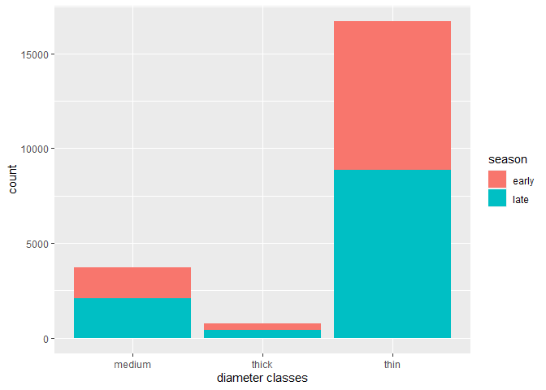
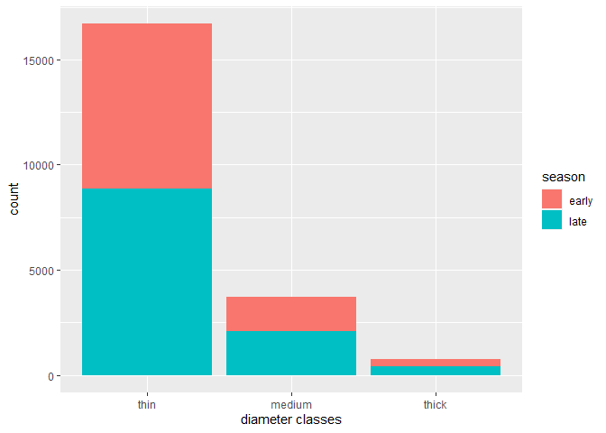

Mini Data Analysis Milestone 2
================

*To complete this milestone, you can edit [this `.rmd`
file](https://raw.githubusercontent.com/UBC-STAT/stat545.stat.ubc.ca/master/content/mini-project/mini-project-2.Rmd)
directly. Fill in the sections that are commented out with
`<!--- start your work here--->`. When you are done, make sure to knit
to an `.md` file by changing the output in the YAML header to
`github_document`, before submitting a tagged release on canvas.*

# Welcome to your second (and last) milestone in your mini data analysis project!

In Milestone 1, you explored your data, came up with research questions,
and obtained some results by making summary tables and graphs. This
time, we will first explore more in depth the concept of *tidy data.*
Then, you’ll be sharpening some of the results you obtained from your
previous milestone by:

- Manipulating special data types in R: factors and/or dates and times.
- Fitting a model object to your data, and extract a result.
- Reading and writing data as separate files.

**NOTE**: The main purpose of the mini data analysis is to integrate
what you learn in class in an analysis. Although each milestone provides
a framework for you to conduct your analysis, it’s possible that you
might find the instructions too rigid for your data set. If this is the
case, you may deviate from the instructions – just make sure you’re
demonstrating a wide range of tools and techniques taught in this class.

# Instructions

**To complete this milestone**, edit [this very `.Rmd`
file](https://raw.githubusercontent.com/UBC-STAT/stat545.stat.ubc.ca/master/content/mini-project/mini-project-2.Rmd)
directly. Fill in the sections that are tagged with
`<!--- start your work here--->`.

**To submit this milestone**, make sure to knit this `.Rmd` file to an
`.md` file by changing the YAML output settings from
`output: html_document` to `output: github_document`. Commit and push
all of your work to your mini-analysis GitHub repository, and tag a
release on GitHub. Then, submit a link to your tagged release on canvas.

**Points**: This milestone is worth 55 points (compared to the 45 points
of the Milestone 1): 45 for your analysis, and 10 for your entire
mini-analysis GitHub repository. Details follow.

**Research Questions**: In Milestone 1, you chose two research questions
to focus on. Wherever realistic, your work in this milestone should
relate to these research questions whenever we ask for justification
behind your work. In the case that some tasks in this milestone don’t
align well with one of your research questions, feel free to discuss
your results in the context of a different research question.

# Learning Objectives

By the end of this milestone, you should:

- Understand what *tidy* data is, and how to create it using `tidyr`.
- Generate a reproducible and clear report using R Markdown.
- Manipulating special data types in R: factors and/or dates and times.
- Fitting a model object to your data, and extract a result.
- Reading and writing data as separate files.

# Setup

Begin by loading your data and the tidyverse package below:

``` r
library(datateachr) # <- might contain the data you picked!
library(tidyverse)
library(dplyr)
library(broom)
library(forcats)
library(here)
```

# Task 1: Tidy your data (15 points)

In this task, we will do several exercises to reshape our data. The goal
here is to understand how to do this reshaping with the `tidyr` package.

A reminder of the definition of *tidy* data:

- Each row is an **observation**
- Each column is a **variable**
- Each cell is a **value**

*Tidy’ing* data is sometimes necessary because it can simplify
computation. Other times it can be nice to organize data so that it can
be easier to understand when read manually.

### 2.1 (2.5 points)

Based on the definition above, can you identify if your data is tidy or
untidy? Go through all your columns, or if you have \>8 variables, just
pick 8, and explain whether the data is untidy or tidy.

<!--------------------------- Start your work below --------------------------->

``` r
vancouver_trees <- as_tibble(datateachr::vancouver_trees)
vancouver_subset <- vancouver_trees[, 1:8]
```

The data is tidy as each row is an observation(tree id which represents
individual tree) and each column is a variable with values in cell.
<!----------------------------------------------------------------------------->

### 2.2 (5 points)

Now, if your data is tidy, untidy it! Then, tidy it back to it’s
original state.

If your data is untidy, then tidy it! Then, untidy it back to it’s
original state.

Be sure to explain your reasoning for this task. Show us the “before”
and “after”.

<!--------------------------- Start your work below --------------------------->

``` r
# untidy data
vancouver_subset_untidy <- vancouver_subset %>% 
                pivot_wider(names_from = assigned,
                            values_from = civic_number)
print(vancouver_subset_untidy)
```

    ## # A tibble: 146,611 × 8
    ##    tree_id std_street    genus_name species_name cultivar_…¹ commo…²     N     Y
    ##      <dbl> <chr>         <chr>      <chr>        <chr>       <chr>   <dbl> <dbl>
    ##  1  149556 W 58TH AV     ULMUS      AMERICANA    BRANDON     BRANDO…   494    NA
    ##  2  149563 W 58TH AV     ZELKOVA    SERRATA      <NA>        JAPANE…   450    NA
    ##  3  149579 WINDSOR ST    STYRAX     JAPONICA     <NA>        JAPANE…  4994    NA
    ##  4  149590 E 39TH AV     FRAXINUS   AMERICANA    AUTUMN APP… AUTUMN…    NA   858
    ##  5  149604 WINDSOR ST    ACER       CAMPESTRE    <NA>        HEDGE …  5032    NA
    ##  6  149616 W 61ST AV     PYRUS      CALLERYANA   CHANTICLEER CHANTI…   585    NA
    ##  7  149617 SHERBROOKE ST ACER       PLATANOIDES  COLUMNARE   COLUMN…  4909    NA
    ##  8  149618 SHERBROOKE ST ACER       PLATANOIDES  COLUMNARE   COLUMN…  4925    NA
    ##  9  149619 SHERBROOKE ST ACER       PLATANOIDES  COLUMNARE   COLUMN…  4969    NA
    ## 10  149625 E 39TH AV     FRAXINUS   AMERICANA    AUTUMN APP… AUTUMN…   720    NA
    ## # … with 146,601 more rows, and abbreviated variable names ¹​cultivar_name,
    ## #   ²​common_name

``` r
# Convert untidy back to tidy
vancouver_subset_tidy <- vancouver_subset_untidy %>% 
                pivot_longer(cols = c(Y, N),
                            names_to = "assigned", 
                            values_to = "civic_number",
                            values_drop_na = TRUE) %>%
                select(tree_id, civic_number, assigned, everything()) 
print(vancouver_subset_tidy)
```

    ## # A tibble: 146,611 × 8
    ##    tree_id civic_number assigned std_street    genus_n…¹ speci…² culti…³ commo…⁴
    ##      <dbl>        <dbl> <chr>    <chr>         <chr>     <chr>   <chr>   <chr>  
    ##  1  149556          494 N        W 58TH AV     ULMUS     AMERIC… BRANDON BRANDO…
    ##  2  149563          450 N        W 58TH AV     ZELKOVA   SERRATA <NA>    JAPANE…
    ##  3  149579         4994 N        WINDSOR ST    STYRAX    JAPONI… <NA>    JAPANE…
    ##  4  149590          858 Y        E 39TH AV     FRAXINUS  AMERIC… AUTUMN… AUTUMN…
    ##  5  149604         5032 N        WINDSOR ST    ACER      CAMPES… <NA>    HEDGE …
    ##  6  149616          585 N        W 61ST AV     PYRUS     CALLER… CHANTI… CHANTI…
    ##  7  149617         4909 N        SHERBROOKE ST ACER      PLATAN… COLUMN… COLUMN…
    ##  8  149618         4925 N        SHERBROOKE ST ACER      PLATAN… COLUMN… COLUMN…
    ##  9  149619         4969 N        SHERBROOKE ST ACER      PLATAN… COLUMN… COLUMN…
    ## 10  149625          720 N        E 39TH AV     FRAXINUS  AMERIC… AUTUMN… AUTUMN…
    ## # … with 146,601 more rows, and abbreviated variable names ¹​genus_name,
    ## #   ²​species_name, ³​cultivar_name, ⁴​common_name

First of all, I changed the tidy data set to untidy as the question
wants me to do so. For this I used pivot_wider() function and named the
untidy dataset as vancouver_subset_untidy. In this I made new columns
with Yes and No response of the assigned variable. The data set became
untidy as the assigned responses Y and N are not variables. Thus, to
take the untidy data back to its tidy form, I used pivot_longer()
function where I reordered the columns using select() and joined the
other columns as they were in the original data using everything(). The
position of column is shifted but it doesn’t matter as the data set is
already tidy.

<!----------------------------------------------------------------------------->

### 2.3 (7.5 points)

Now, you should be more familiar with your data, and also have made
progress in answering your research questions. Based on your interest,
and your analyses, pick 2 of the 4 research questions to continue your
analysis in the next four tasks:

<!-------------------------- Start your work below ---------------------------->

1.  *Previous: How does the diameter differ in 2 genus: Acer and Quercus
    *

*Updated: How does the diameter differ in 4 genus: Acer,Quercus, Pyrus,
Zelkova? *

2.  *Previous: Is the diameter affected by curb *

*Updated: Is the diameter of plant with curb affected by plantation
month? *

<!----------------------------------------------------------------------------->

Explain your decision for choosing the above two research questions.

<!--------------------------- Start your work below --------------------------->

In the previous analysis 1, I compared the diameter of two genus, but
now I want to see the diameter difference between 4 species. Next, this
time I want to further see if the diameter of plants with curbs are
affected by season of plantation. For this, I want to extract months of
plantation and see if the diameter in the trees differ with respect to
month of plantation.

<!----------------------------------------------------------------------------->

Now, try to choose a version of your data that you think will be
appropriate to answer these 2 questions. Use between 4 and 8 functions
that we’ve covered so far (i.e. by filtering, cleaning, tidy’ing,
dropping irrelevant columns, etc.).

<!--------------------------- Start your work below --------------------------->

``` r
# Question 1: How does the diameter differ in 4 genus: Acer,Quercus, Pyrus, Zelkova?
target <- c("ACER", "QUERCUS", "PYRUS", "ZELKOVA")
four_species <- filter(vancouver_trees, genus_name %in% target)
meandiameter <- four_species %>%
group_by(genus_name) %>%
summarize(avedia = mean(diameter)) %>%
arrange(desc(avedia))
print(meandiameter)
```

    ## # A tibble: 4 × 2
    ##   genus_name avedia
    ##   <chr>       <dbl>
    ## 1 QUERCUS     15.2 
    ## 2 ACER        10.6 
    ## 3 ZELKOVA      6.88
    ## 4 PYRUS        4.58

We can see that the average diameter of genus Quercus is greater than
Acer followed by Zelkova and the least average diameter is of Pyrus.

``` r
#Is the diameter of plant with curb affected by plantation month?
library(lubridate)
```

    ## 
    ## Attaching package: 'lubridate'

    ## The following objects are masked from 'package:base':
    ## 
    ##     date, intersect, setdiff, union

``` r
vancouver_trees_curb <- filter(vancouver_trees,curb=="Y")
datedata <- vancouver_trees_curb$date_planted
m <- month(as.POSIXlt(datedata, format="%Y-%m-%d"))
vancouver_trees_curb$month_plantation <- m


vancouver_trees_curb %>%
  remove_missing() %>%
    group_by(month_plantation) %>%
  summarize(average_diameter_seasonal = mean(diameter))
```

    ## Warning: Removed 94873 rows containing missing values.

    ## # A tibble: 12 × 2
    ##    month_plantation average_diameter_seasonal
    ##               <dbl>                     <dbl>
    ##  1                1                      5.59
    ##  2                2                      5.46
    ##  3                3                      5.85
    ##  4                4                      5.80
    ##  5                5                      5.83
    ##  6                6                      7.21
    ##  7                7                      6.57
    ##  8                8                     10.5 
    ##  9                9                      6.13
    ## 10               10                      5.31
    ## 11               11                      6.02
    ## 12               12                      5.85

We can see that the trees with curb planted in August has highest
diameter.

<!----------------------------------------------------------------------------->

# Task 2: Special Data Types (10)

For this exercise, you’ll be choosing two of the three tasks below –
both tasks that you choose are worth 5 points each.

But first, tasks 1 and 2 below ask you to modify a plot you made in a
previous milestone. The plot you choose should involve plotting across
at least three groups (whether by facetting, or using an aesthetic like
colour). Place this plot below (you’re allowed to modify the plot if
you’d like). If you don’t have such a plot, you’ll need to make one.
Place the code for your plot below.

<!-------------------------- Start your work below ---------------------------->

I don’t have any plots as mentioned above in earlier milestone, hence I
would like to create a plot like that first. I have divided diameters
into thin, medium and thick. I also divided the months of plantation
into early and late.

``` r
#Creating a plot 
# Create a categorical variable with 3 groups for diameter excluding the outliers:

#Classes of diameter

diameter_class <- numeric()
diameter_class[vancouver_trees_curb$diameter < 4.5] <- "thin"
diameter_class[vancouver_trees_curb$diameter >= 4.5 & vancouver_trees_curb$diameter < 6] <- "medium"
diameter_class[vancouver_trees_curb$diameter >= 16] <- "thick"
diameter_class <- as.factor(diameter_class)

#Season category

season <- numeric()
season[vancouver_trees_curb$month_plantation > 3 & vancouver_trees_curb$month_plantation <= 12] <- "late"
season[vancouver_trees_curb$month_plantation < 3] <- "early"
season <- as.factor(season)
vancouver_trees_curb$season <- season


# use ggplot to plot
vancouver_trees_curb$diameter_class <- diameter_class 
a <- na.omit(vancouver_trees_curb)
ggplot(a, aes(x = diameter_class, ..count..)) + geom_bar(aes(fill= season)) + labs(x = "diameter classes")
```

<!-- -->

<!----------------------------------------------------------------------------->

Now, choose two of the following tasks.

1.  Produce a new plot that reorders a factor in your original plot,
    using the `forcats` package (3 points). Then, in a sentence or two,
    briefly explain why you chose this ordering (1 point here for
    demonstrating understanding of the reordering, and 1 point for
    demonstrating some justification for the reordering, which could be
    subtle or speculative.)

2.  Produce a new plot that groups some factor levels together into an
    “other” category (or something similar), using the `forcats` package
    (3 points). Then, in a sentence or two, briefly explain why you
    chose this grouping (1 point here for demonstrating understanding of
    the grouping, and 1 point for demonstrating some justification for
    the grouping, which could be subtle or speculative.)

3.  If your data has some sort of time-based column like a date (but
    something more granular than just a year):

    1.  Make a new column that uses a function from the `lubridate` or
        `tsibble` package to modify your original time-based column. (3
        points)

        - Note that you might first have to *make* a time-based column
          using a function like `ymd()`, but this doesn’t count.
        - Examples of something you might do here: extract the day of
          the year from a date, or extract the weekday, or let 24 hours
          elapse on your dates.

    2.  Then, in a sentence or two, explain how your new column might be
        useful in exploring a research question. (1 point for
        demonstrating understanding of the function you used, and 1
        point for your justification, which could be subtle or
        speculative).

        - For example, you could say something like “Investigating the
          day of the week might be insightful because penguins don’t
          work on weekends, and so may respond differently”.

<!-------------------------- Start your work below ---------------------------->

**Task Number**: 1

``` r
ggplot(a, aes(x=fct_reorder(diameter_class, diameter), ..count..)) +   geom_bar(aes(fill=season)) + labs(x = "diameter classes")
```

<!-- --> I have divided
diameters into thin, medium and thick. I also divided the months of
plantation into early and late.

<!----------------------------------------------------------------------------->
<!-------------------------- Start your work below ---------------------------->

**Task Number**: 2 (3rd)

``` r
vancouver_trees_curb <- filter(vancouver_trees,curb=="Y")
datedata <- vancouver_trees_curb$date_planted
m <- month(as.POSIXlt(datedata, format="%Y-%m-%d"))
vancouver_trees_curb$month_plantation <- m
head(vancouver_trees_curb)
```

    ## # A tibble: 6 × 21
    ##   tree_id civic_number std_str…¹ genus…² speci…³ culti…⁴ commo…⁵ assig…⁶ root_…⁷
    ##     <dbl>        <dbl> <chr>     <chr>   <chr>   <chr>   <chr>   <chr>   <chr>  
    ## 1  149579         4994 WINDSOR … STYRAX  JAPONI… <NA>    JAPANE… N       N      
    ## 2  149590          858 E 39TH AV FRAXIN… AMERIC… AUTUMN… AUTUMN… Y       N      
    ## 3  149604         5032 WINDSOR … ACER    CAMPES… <NA>    HEDGE … N       N      
    ## 4  149616          585 W 61ST AV PYRUS   CALLER… CHANTI… CHANTI… N       N      
    ## 5  149617         4909 SHERBROO… ACER    PLATAN… COLUMN… COLUMN… N       N      
    ## 6  149618         4925 SHERBROO… ACER    PLATAN… COLUMN… COLUMN… N       N      
    ## # … with 12 more variables: plant_area <chr>, on_street_block <dbl>,
    ## #   on_street <chr>, neighbourhood_name <chr>, street_side_name <chr>,
    ## #   height_range_id <dbl>, diameter <dbl>, curb <chr>, date_planted <date>,
    ## #   longitude <dbl>, latitude <dbl>, month_plantation <dbl>, and abbreviated
    ## #   variable names ¹​std_street, ²​genus_name, ³​species_name, ⁴​cultivar_name,
    ## #   ⁵​common_name, ⁶​assigned, ⁷​root_barrier

I created a column with only the months of plantation extracted from the
date (yy-mm-dd) This may be useful to see if the plantation month have
roles in growth of trees.

<!----------------------------------------------------------------------------->

# Task 3: Modelling

## 2.0 (no points)

Pick a research question, and pick a variable of interest (we’ll call it
“Y”) that’s relevant to the research question. Indicate these.

<!-------------------------- Start your work below ---------------------------->

**Research Question**: I want to find if diameter of plant with curb is
influenced by plantation season.

**Variable of interest**: diameter of trees

<!----------------------------------------------------------------------------->

## 2.1 (5 points)

Fit a model or run a hypothesis test that provides insight on this
variable with respect to the research question. Store the model object
as a variable, and print its output to screen. We’ll omit having to
justify your choice, because we don’t expect you to know about model
specifics in STAT 545.

- **Note**: It’s OK if you don’t know how these models/tests work. Here
  are some examples of things you can do here, but the sky’s the limit.

  - You could fit a model that makes predictions on Y using another
    variable, by using the `lm()` function.
  - You could test whether the mean of Y equals 0 using `t.test()`, or
    maybe the mean across two groups are different using `t.test()`, or
    maybe the mean across multiple groups are different using `anova()`
    (you may have to pivot your data for the latter two).
  - You could use `lm()` to test for significance of regression.

<!-------------------------- Start your work below ----------------------------->

``` r
m = t.test(a$diameter~a$season)
print(m)
```

    ## 
    ##  Welch Two Sample t-test
    ## 
    ## data:  a$diameter by a$season
    ## t = -2.7108, df = 21084, p-value = 0.006718
    ## alternative hypothesis: true difference in means between group early and group late is not equal to 0
    ## 95 percent confidence interval:
    ##  -0.2147818 -0.0345191
    ## sample estimates:
    ## mean in group early  mean in group late 
    ##            3.972518            4.097169

Since the p value is less than 0.05, we can see that true difference in
means between group early and group late plantation is not equal to
0.This shows that there is significant difference between
————————————————————————\>

## 2.2 (5 points)

Produce something relevant from your fitted model: either predictions on
Y, or a single value like a regression coefficient or a p-value.

- Be sure to indicate in writing what you chose to produce.
- Your code should either output a tibble (in which case you should
  indicate the column that contains the thing you’re looking for), or
  the thing you’re looking for itself.
- Obtain your results using the `broom` package if possible. If your
  model is not compatible with the broom function you’re needing, then
  you can obtain your results by some other means, but first indicate
  which broom function is not compatible.

<!-------------------------- Start your work below ------------>

``` r
library(broom)
m = t.test(a$diameter~a$season)
model <- tidy(m) %>%
mutate_if(is.numeric, round, 3)
model
```

    ## # A tibble: 1 × 10
    ##   estim…¹ estim…² estim…³ stati…⁴ p.value param…⁵ conf.…⁶ conf.…⁷ method alter…⁸
    ##     <dbl>   <dbl>   <dbl>   <dbl>   <dbl>   <dbl>   <dbl>   <dbl> <chr>  <chr>  
    ## 1  -0.125    3.97    4.10   -2.71   0.007  21084.  -0.215  -0.035 Welch… two.si…
    ## # … with abbreviated variable names ¹​estimate, ²​estimate1, ³​estimate2,
    ## #   ⁴​statistic, ⁵​parameter, ⁶​conf.low, ⁷​conf.high, ⁸​alternative

I used tidy to get the results of my modelling in a data frame where I
can easily see the values of t statistics and p value and interpret them
easily.

<!----------------------------------------------------------------------------->

# Task 4: Reading and writing data

Get set up for this exercise by making a folder called `output` in the
top level of your project folder / repository. You’ll be saving things
there.

## 3.1 (5 points)

Take a summary table that you made from Milestone 1 (Task 4.2), and
write it as a csv file in your `output` folder. Use the `here::here()`
function.

- **Robustness criteria**: You should be able to move your Mini Project
  repository / project folder to some other location on your computer,
  or move this very Rmd file to another location within your project
  repository / folder, and your code should still work.
- **Reproducibility criteria**: You should be able to delete the csv
  file, and remake it simply by knitting this Rmd file.

**I have created another summary table instead of 4.2**

<!-------------------------- Start your work below ---------------------------->

``` r
result <- vancouver_trees %>%
  filter(genus_name %in% c("QUERCUS","ACER"))
result_summary <- 
 result %>%
  select(genus_name, diameter) %>%
  group_by(genus_name) %>%
  summarize(mean_diam = mean(diameter),
            median_diam = median(diameter),
            sd_diam = sd(diameter),
            range_diam = range(diameter))
```

    ## `summarise()` has grouped output by 'genus_name'. You can override using the
    ## `.groups` argument.

``` r
table<- data.frame(result_summary)
dir.create(here::here("Output_MDA2"))
```

    ## Warning in dir.create(here::here("Output_MDA2")): 'C:\Users\sima25\OneDrive -
    ## UBC\COURSES\STAT 545 A\GIT\SimaKhanal_MiniAnalysis\Output_MDA2' already exists

``` r
write_csv(table, here("Output_MDA2", "exported_table.csv"))
```

<!----------------------------------------------------------------------------->

## 3.2 (5 points)

Write your model object from Task 3 to an R binary file (an RDS), and
load it again. Be sure to save the binary file in your `output` folder.
Use the functions `saveRDS()` and `readRDS()`.

- The same robustness and reproducibility criteria as in 3.1 apply here.

<!---------- Start your work below ------------------------------------>

``` r
saveRDS(model, here("Output_MDA2", "model.RDS"))
model_read <- readRDS(here("Output_MDA2", "model.RDS"))
model_read
```

    ## # A tibble: 1 × 10
    ##   estim…¹ estim…² estim…³ stati…⁴ p.value param…⁵ conf.…⁶ conf.…⁷ method alter…⁸
    ##     <dbl>   <dbl>   <dbl>   <dbl>   <dbl>   <dbl>   <dbl>   <dbl> <chr>  <chr>  
    ## 1  -0.125    3.97    4.10   -2.71   0.007  21084.  -0.215  -0.035 Welch… two.si…
    ## # … with abbreviated variable names ¹​estimate, ²​estimate1, ³​estimate2,
    ## #   ⁴​statistic, ⁵​parameter, ⁶​conf.low, ⁷​conf.high, ⁸​alternative

<!---------------------------------------------------------------------->

# Tidy Repository

Now that this is your last milestone, your entire project repository
should be organized. Here are the criteria we’re looking for.

## Main README (3 points)

There should be a file named `README.md` at the top level of your
repository. Its contents should automatically appear when you visit the
repository on GitHub.

Minimum contents of the README file:

- In a sentence or two, explains what this repository is, so that
  future-you or someone else stumbling on your repository can be
  oriented to the repository.
- In a sentence or two (or more??), briefly explains how to engage with
  the repository. You can assume the person reading knows the material
  from STAT 545A. Basically, if a visitor to your repository wants to
  explore your project, what should they know?

Once you get in the habit of making README files, and seeing more README
files in other projects, you’ll wonder how you ever got by without them!
They are tremendously helpful.

## File and Folder structure (3 points)

You should have at least four folders in the top level of your
repository: one for each milestone, and one output folder. If there are
any other folders, these are explained in the main README.

Each milestone document is contained in its respective folder, and
nowhere else.

Every level-1 folder (that is, the ones stored in the top level, like
“Milestone1” and “output”) has a `README` file, explaining in a sentence
or two what is in the folder, in plain language (it’s enough to say
something like “This folder contains the source for Milestone 1”).

## Output (2 points)

All output is recent and relevant:

- All Rmd files have been `knit`ted to their output, and all data files
  saved from Task 4 above appear in the `output` folder.
- All of these output files are up-to-date – that is, they haven’t
  fallen behind after the source (Rmd) files have been updated.
- There should be no relic output files. For example, if you were
  knitting an Rmd to html, but then changed the output to be only a
  markdown file, then the html file is a relic and should be deleted.

Our recommendation: delete all output files, and re-knit each
milestone’s Rmd file, so that everything is up to date and relevant.

PS: there’s a way where you can run all project code using a single
command, instead of clicking “knit” three times. More on this in STAT
545B!

## Error-free code (1 point)

This Milestone 1 document knits error-free, and the Milestone 2 document
knits error-free.

## Tagged release (1 point)

You’ve tagged a release for Milestone 1, and you’ve tagged a release for
Milestone 2.

### Attribution

Thanks to Victor Yuan for mostly putting this together.
